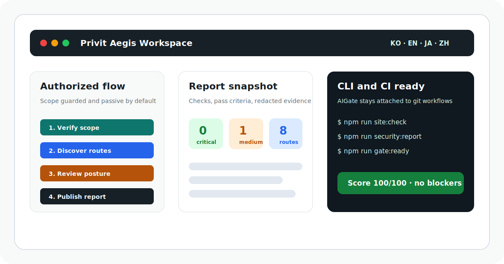

# Privit Aegis Workspace

<p align="center">
  <a href="https://github.com/LeeHueeng/privit-aegis-workspace/actions/workflows/ci.yml"></a>
  <a href="https://github.com/LeeHueeng/privit-aegis-workspace/actions/workflows/pages.yml"></a>
  <a href="https://github.com/LeeHueeng/privit-aegis-workspace/actions/workflows/codeql.yml"></a>
  <a href="https://github.com/LeeHueeng/privit-aegis-workspace/actions/workflows/scorecard.yml"></a>
  
  
</p>

<p align="center">
  <a href="./README.ko.md">한국어</a> ·
  <a href="./README.md">English</a> ·
  <a href="./README.ja.md">日本語</a> ·
  <a href="./README.zh-CN.md">中文</a> ·
  <a href="https://leehueeng.github.io/privit-aegis-workspace/">GitHub Pages</a>
</p>

Privit Aegis Workspace is an authorized security testing console for the Privit
web app. It combines the Aegis CLI, a local web console, passive site discovery,
deterministic web security checks, localized reports, AI-assisted remediation
prompts, and AIGate push readiness in one repo.

The project is built for approved assets only. It is passive by default,
scope-guarded, and designed to show exactly what was checked, what passed, what
failed, and what evidence was retained.

<p align="center">
  
</p>

## Why Star It

- Web console and CLI workflows live together, so local testing and CI use the
  same security baseline.
- Korean, English, Japanese, and Chinese documentation are first-class entry
  points instead of afterthought translations.
- Reports explain executed checks, pass criteria, redacted evidence, and
  recommended fixes.
- AI is optional and transparent: it helps with provider readiness and
  remediation prompts, while scan findings stay deterministic.
- GitHub Actions are pinned, scoped to least privilege, and separated from local
  AIGate/git-push workflows.
- CodeQL, Dependency Review, OpenSSF Scorecard, SBOM generation, and provenance
  attestations are wired into the public repository security baseline.

## Live Documentation

- Public project site after Pages is enabled: <https://leehueeng.github.io/privit-aegis-workspace/>
- Security scanning guide: [`docs/security-scanning.md`](./docs/security-scanning.md)
- Hardening baseline: [`docs/security-hardening-baseline.md`](./docs/security-hardening-baseline.md)
- AI integration: [`docs/ai-integration.md`](./docs/ai-integration.md)
- Repository roles: [`docs/REPOSITORY_ROLES.md`](./docs/REPOSITORY_ROLES.md)
- Supply-chain security: [`docs/SUPPLY_CHAIN_SECURITY.md`](./docs/SUPPLY_CHAIN_SECURITY.md)
- Public CLI engine: <https://github.com/LeeHueeng/privit-project>
- GitHub workflow security: [`docs/github-security-hardening.md`](./docs/github-security-hardening.md)
- GitHub Pages setup: [`docs/github-pages.md`](./docs/github-pages.md)
- Showcase: [`docs/SHOWCASE.md`](./docs/SHOWCASE.md)
- Examples: [`docs/EXAMPLES.md`](./docs/EXAMPLES.md)
- Architecture: [`docs/ARCHITECTURE.md`](./docs/ARCHITECTURE.md)
- Detection matrix: [`docs/DETECTION_MATRIX.md`](./docs/DETECTION_MATRIX.md)
- FAQ: [`docs/FAQ.md`](./docs/FAQ.md)
- Privacy and data handling: [`docs/PRIVACY_AND_DATA.md`](./docs/PRIVACY_AND_DATA.md)
- Threat model: [`docs/THREAT_MODEL.md`](./docs/THREAT_MODEL.md)
- Safe demo scope: [`docs/SAFE_SCOPE_TEMPLATE.md`](./docs/SAFE_SCOPE_TEMPLATE.md)
- Release process: [`docs/RELEASE_PROCESS.md`](./docs/RELEASE_PROCESS.md)
- Launch checklist: [`docs/LAUNCH_CHECKLIST.md`](./docs/LAUNCH_CHECKLIST.md)
- Language index: [`docs/LANGUAGES.md`](./docs/LANGUAGES.md)

## Quick Start

```sh
npm run setup
npm run web
```

Open `http://127.0.0.1:4317` to review scope settings, run checks, and view the
latest localized HTML report.

## Demo in 60 Seconds

```sh
npm run site:check
npm run security:map
npm run security:target
npm run security:report
npm run security:penetration
```

The web console runs the same flow from a browser and streams progress while the
CLI keeps the commands copyable for CI, documentation, and reviews.

## Security Checks

Aegis keeps the default workflow low-impact:

- Generates a security-check catalog and validates authorized scope.
- Discovers same-scope routes, links, forms, auth surfaces, sitemap entries, and
  blocked URLs.
- Reviews browser security headers, authentication cache posture, cookies,
  forms, redirect-like parameters, API surfaces, GraphQL/OpenAPI/OIDC/JWKS
  metadata, CORS/CSP quality, SRI, mixed content, bundle leakage, and sensitive
  public files.
- Produces an HTML report plus a penetration/security testing report that lists
  executed checks, pass criteria, and redacted evidence.

All configured checks are passive by default. Discovery follows only allowlisted
hosts and paths, does not submit forms, and does not run brute-force or
destructive tests.

## Quality Gate

```sh
npm run site:check
npm run security:audit
npm run security:hardening
npm run ci:aegis
npm run gate:ready
```

`AIGate` is reserved for git push and CI quality gates. The local web console
focuses on Aegis actions such as catalog generation, scope verification,
discovery, target advisory checks, localized reports, and penetration reports.

## AI Assistants

```sh
npm run ai:integrate
npm run ai:doctor
npm run ai:report
npm run ai:model:show
npm run ai:model:check
npm run ai:settings:show
```

Codex, Gemini, Claude, local AI, and direct API providers share the same scope
and handoff model. AI does not decide passive scan results; it supports
configuration checks, provider readiness, remediation prompts, and optional
AIGate AI reports.

## Repository Map

- `privit-aegis-workspace`: this repository; web console, reports, docs,
  GitHub Pages, AI settings, CI, and Privit-specific scope wiring.
- `privit-project`: reusable Aegis CLI engine installed by this workspace.
- `scripts/`: local console, report localization, hardening checks, AI settings,
  GitHub readiness, and report generation helpers.
- `docs/`: security guides, multilingual human/agent guides, roadmap, and Pages
  documentation.
- `docs/pages/`: GitHub Pages static site.
- `.github/workflows/`: pinned CI and GitHub Pages workflows.
- `catalog/`: generated Aegis security-check catalog.

## GitHub Pages

The Pages site is deployed from `docs/pages` through
`.github/workflows/pages.yml`. The workflow uses GitHub Pages Actions with
minimal permissions: `contents: read`, `pages: write`, and `id-token: write`.
See [`docs/github-pages.md`](./docs/github-pages.md) for the activation command
and deployment notes.

## Security Model

This repository is for authorized security testing only. Do not add production
credentials, live payment paths, destructive actions, or third-party systems
unless written authorization is recorded in `aegis.scope.json`. Secrets,
cookies, tokens, passwords, API keys, private keys, email addresses, and payment
identifiers are redacted before reporting.

Use [`aegis.scope.example.json`](./aegis.scope.example.json) as the safe public
demo scope. Keep private or staging targets in local, uncommitted scope files.

## Contributing

Issues, feature ideas, docs improvements, and carefully scoped security checks
are welcome. Start with [`CONTRIBUTING.md`](./CONTRIBUTING.md), keep changes
passive by default, and run the local quality gate before opening a PR.
For support boundaries, see [`SUPPORT.md`](./SUPPORT.md).
