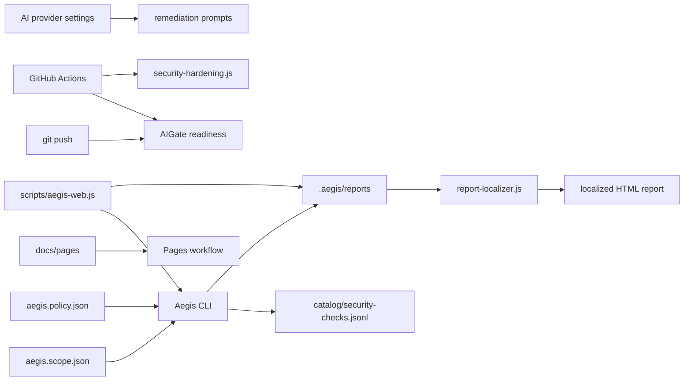

# Architecture

Privit Aegis is a thin workspace around the private Aegis CLI engine. The
workspace keeps project-specific scope, web-console orchestration, report
localization, AI provider settings, and GitHub quality gates.

## Boundaries

- `privit-aegis-workspace` stores project wiring, local reports, docs, and CI.
- `privit-project` stores the private Aegis CLI engine and scanner logic.
- `.aegis/` is local generated state and should not be committed unless outputs
  are intentionally sanitized.
- AIGate is a git/CI quality gate, not a web-console scan button.

## Runtime Flow

1. `aegis.scope.json` defines authorized targets, hosts, denied paths, and
   safety flags.
2. `npm run catalog:generate` refreshes the check catalog.
3. `npm run security:verify` confirms scope and authorization metadata.
4. `npm run security:map` performs passive discovery.
5. `npm run security:target` performs passive posture checks.
6. `npm run security:report` generates and localizes the HTML report.
7. `npm run security:penetration` creates the penetration/security testing
   report with pass criteria.
8. `npm run gate:ready` verifies git-push readiness.

## Design Principles

- Passive by default
- Explicit authorization before target access
- Redacted evidence in reports
- Deterministic findings before AI assistance
- Multilingual public entry points
- CI and local commands share the same baseline
